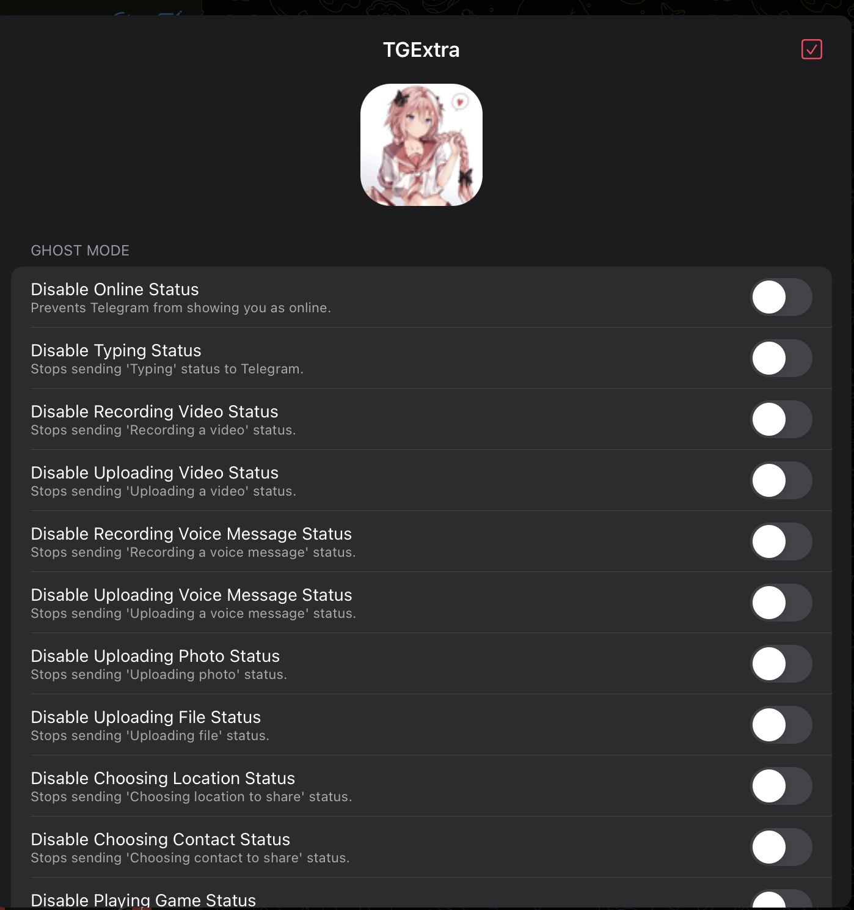
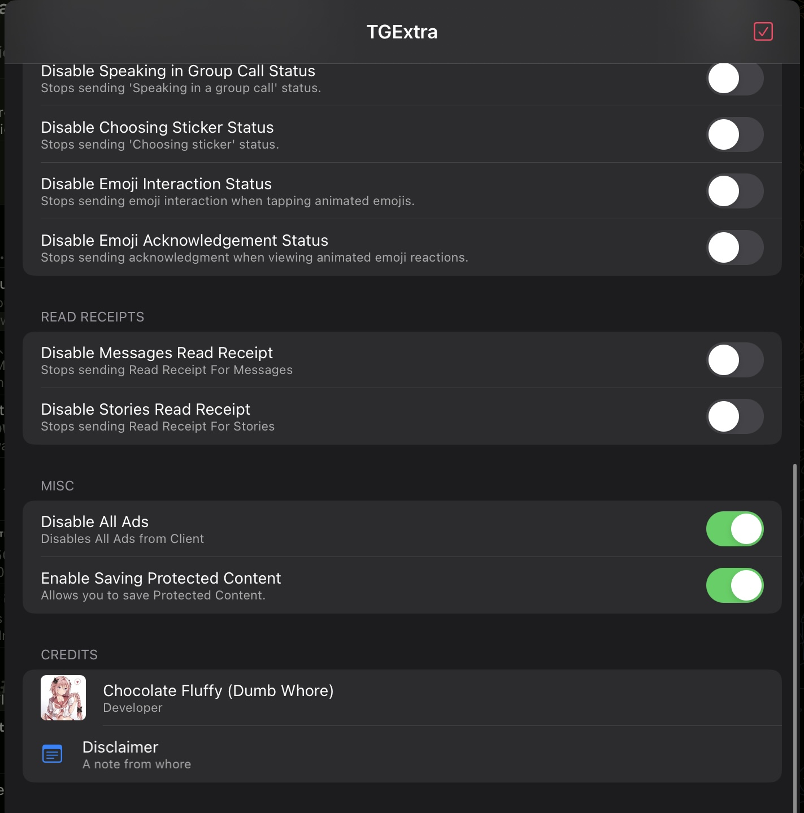

# TGExtra
A simple Telegram iOS Tweak.

To Open Tweak menu : Longpress screen with 3 finger (if no flex injected) of 4 fingers.

## Screenshots

## Features

- Disable Ads
- Ghost Mode
- No Read Receipt for messages and Stories
- Allow saving Protected Content (compatibility depends on the Telegram build)
- Keep messages visible when they are deleted by the sender
- Open disappearing media without starting the server-side deletion timer
- Disable screenshot notifications and protected-screen overlays
- Confirm before starting audio and video calls

## Disclaimer

This project is an **independent modification (tweak)** for the Telegram app. I am **not affiliated, associated, authorized, endorsed by, or in any way officially connected with Telegram Messenger LLP**, or any of its subsidiaries or affiliates.

This tweak is created solely for **personal and educational purposes**. Use it at your own risk.

**I do not take any responsibility for any issues, damages, or consequences** resulting from the use or misuse of this tweak. If something breaks, it's not my problem.
